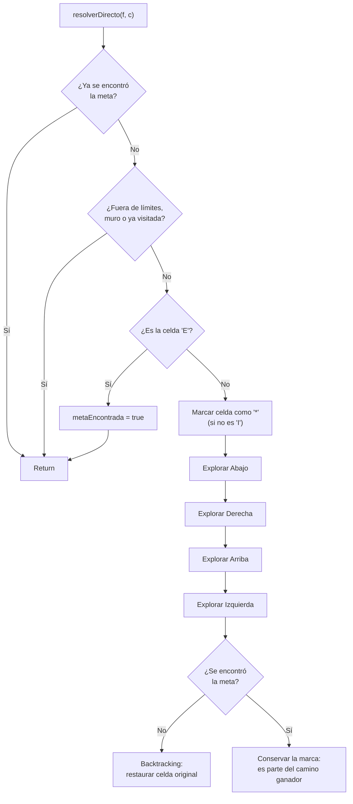

# 🐭 Generador y Solucionador de Laberintos (DFS + Backtracking)

Programa en **C++** que genera un laberinto aleatorio de tamaño configurable y lo resuelve automáticamente usando búsqueda en profundidad (**DFS**) con **backtracking**, marcando visualmente el camino encontrado desde la entrada hasta la salida.

---

## 📋 Descripción

El programa hace dos cosas en secuencia:

1. **Genera** un laberinto de `filas x columnas` celdas, garantizando siempre que exista al menos un camino válido entre la entrada y la salida.
2. **Resuelve** ese laberinto con un algoritmo recursivo de backtracking y muestra el recorrido ganador marcado con `*`, además del tiempo que tardó en encontrarlo.

## 🎮 Demo real

Ejecución real del programa con un laberinto de 8 filas × 10 columnas:

```
--- LABERINTO GENERADO ---
I     #       #     
#   # # # # # # #   
#       #         # 
#   #     #     # # 
        #   #   # # 
      #   #   # #   
  #     # # # # # # 
#                 E 

--- LABERINTO RESUELTO ---
I *   #       #     
# * # # # # # # #   
# *     #         # 
# * #     #     # # 
  *     #   #   # # 
  * * #   #   # #   
  # *   # # # # # # 
#   * * * * * * * E 

El raton encontro el camino marcado con '*'

El laberinto se genero y se encontro salida en: 0.021953 milisegundos.
```

## 🗺️ Leyenda

| Símbolo | Significado |
|---|---|
| `#` | Muro (celda no transitable) |
| ` ` (espacio) | Camino libre |
| `I` | Entrada del laberinto (siempre en `[0][0]`) |
| `E` | Salida del laberinto (siempre en `[filas-1][columnas-1]`) |
| `*` | Celda que forma parte del camino solución (tras resolver) |

## 🧩 Cómo se genera el laberinto

1. Se inicializa toda la grilla con muros (`#`).
2. Se traza un **camino garantizado** desde `(0,0)` hasta `(filas-1, columnas-1)`, avanzando aleatoriamente hacia abajo o hacia la derecha en cada paso. Esto asegura que el laberinto **siempre tenga solución**, sin importar el resto del contenido.
3. Se abren muros adicionales al azar (40% de probabilidad por celda), para agregar bifurcaciones y caminos alternativos y que no sea un pasillo único predecible.
4. Se colocan `I` en la esquina superior izquierda y `E` en la esquina inferior derecha.

## 🔍 Cómo se resuelve: DFS con backtracking

`resolverDirecto()` es una función recursiva que, en cada celda, hace lo siguiente:



La clave está en la bandera global `metaEncontrada`: apenas se llega a `E`, se activa y **corta toda exploración pendiente** (por el chequeo al inicio de la función). Como el backtracking sólo borra la marca `*` cuando la meta **todavía no** se encontró, las celdas del camino que sí llevó a la salida quedan marcadas para siempre, mientras que las de los callejones sin salida se limpian y vuelven a verse como espacio libre.

Orden de exploración en cada celda: **Abajo → Derecha → Arriba → Izquierda**.

## ⏱️ Rendimiento

El tiempo se mide con `std::chrono::high_resolution_clock` y se imprime al final. Algunas pruebas reales:

| Tamaño | Tiempo aproximado |
|---|---|
| 8 × 10 | ~0.02 ms |
| 30 × 40 | ~0.14 ms |
| 500 × 500 (250.000 celdas) | ~47 ms |

> Nota: el cronómetro arranca **antes** de generar el laberinto y termina **después** de imprimir el laberinto resuelto, así que el número reportado incluye generación + impresión por consola + resolución, no solo el tiempo puro de búsqueda.

## ▶️ Cómo compilar y ejecutar

Requiere un compilador de C++ con soporte C++17 (probado con `g++`).

```bash
g++ -std=c++17 -O2 -o laberinto laberinto.cpp
./laberinto
```

El programa va a pedir por consola el número de filas y columnas:

```
Selecciona un tamanho de fila : 8
Selecciona un tamanho de columna : 10
```

## 🧠 Notas técnicas / detalles de diseño

- **La entrada (`I`) nunca se marca como visitada.** Esto hace que, durante el DFS, la celda de entrada pueda ser revisitada varias veces desde distintas ramas antes de que todos sus vecinos queden marcados. No genera un bucle infinito (los vecinos sí se marcan y bloquean re-entradas), pero implica algunas llamadas recursivas redundantes alrededor de esa celda.
- **El laberinto generado siempre es resoluble**, gracias al "túnel garantizado" que se traza antes de agregar aperturas aleatorias — por eso `metaEncontrada` termina en `true` en cualquier ejecución normal.
- **Caso límite (1×1):** si se ingresa una grilla de 1 fila y 1 columna, la celda `[0][0]` se sobrescribe primero con `I` y luego con `E` (mismo índice), por lo que el laberinto arranca ya resuelto. Comportamiento verificado y esperado, no un bug.
- La recursión no tiene límite de profundidad explícito: para laberintos muy grandes (miles de filas/columnas) podría acercarse al límite de stack del sistema. En las pruebas realizadas (hasta 500×500) no hubo problema.


## 👤 Autor

Generador y solucionador de laberintos en C++ (DFS + backtracking).
*(Eduardo Lugo - [linkedin.com/in/eduardo-lugo](https://www.linkedin.com/in/eduardo-antonio-lugo-ruiz-299b83396/))*
